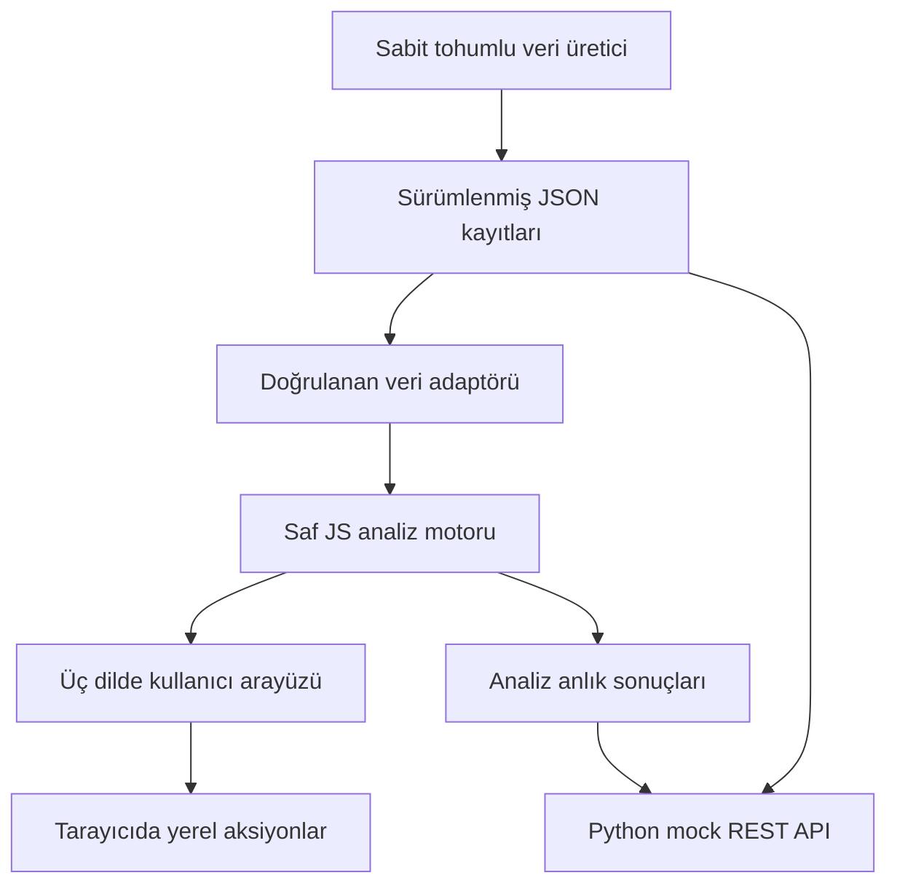

# FlowPilot Architecture

## ERP Integration Ready Architecture

Bu ifade çalışan SAP bağlantısı anlamına gelmez. Veri erişimi, hesaplama ve sunumun ayrı tutulduğunu; ileride bir ERP adaptörü eklenebilecek bir sınır bulunduğunu anlatır.

## 1. Katmanlar ve sorumluluklar

| Katman             | Dosya                   | Karar                                                                                          |
| ------------------ | ----------------------- | ---------------------------------------------------------------------------------------------- |
| Sunum              | `src/main.js`           | HTML üreten ortak UI fonksiyonları ve delegasyonla olay yönetimi; hash tabanlı ekran geçişleri |
| Tasarım sistemi    | `src/styles.css`        | Renk / boşluk / radius tokenları, ortak tablo ve form stili; breakpoint ile yeniden düzenleme  |
| Yerelleştirme      | `src/i18n.js`           | Anahtar bazlı üç sözlük; işletme kuralları dilden bağımsız                                     |
| Uygulama analitiği | `src/engine.js`         | Girdi → çıktı saf fonksiyonları; DOM, ağ ve yerel depolama erişimi yok                         |
| Veri sınırı        | `src/data.js`           | JSON alma, ilişki / alan doğrulama; tarayıcı depolama hata yönetimi                            |
| HTTP adaptörü      | `backend/server.py`     | Sadece mock okuma, doğrulanan sorgu, sayfalama, OpenAPI                                        |
| Örnek veri         | `scripts/generate.mjs`  | Deterministik üreteç; ilişkili kimlikler, tarihler, stok ve gecikme senaryoları                |
| Analiz önhesaplama | `scripts/analytics.mjs` | UI ve API için tek hesaplama kaynağı                                                           |

## 2. Çalışma zamanı ve yayın

İstemci derlenmeden yayınlanır. Npm paketleri sadece test ve biçimlendirme içindir; tarayıcıya gönderilmez. Kök `index.html`, `src/` kaynaklarını kullanır; bağımsız `dist/index.html` ise aynı dizindeki `src/` klasörünü kullanır. Kök dosyalar tek kaynak kabul edilir; `npm run build` aynı dosyaları `dist/` içine kopyalar ve içerik özetli service worker üretir. `dist/` elle düzenlenmez. Tüm yayın dosyalarının byte denkliği `npm run validate` ile kontrol edilir.

Hash tabanlı yönlendirme GitHub Pages üzerinde sunucu rewrite ihtiyacını ortadan kaldırır. Dizin adı veya kullanıcı adı kod içine yazılmamıştır. Veriler `import.meta.url` temelinde yüklenir; alt dizinli yayın korunur.

Bir yüklemede tüm sentetik veri alınır. Bu boyutta sadelik ve dağıtım kolaylığı sağlar. Milyonlarca kayıt için uygun değildir; sunucu sorguları, indeksler, sayfalama ve analitik önhesaplama gerekir.

## 3. Durum ve aksiyon yaşam döngüsü

- Kaynak ERP örnek kayıtları bellekte salt okunur tutulur.
- Dil tercihi, aksiyonlar ve okunmuş bildirim kimlikleri `flowpilot.v1.*` anahtarlarıyla tarayıcıda saklanır.
- Dönem, filtre, seçilen sütun, sıralama ve sayfa oturumluk UI durumudur.
- Ekran değişince önceki ekranın filtreleri ve sıralaması sıfırlanır.
- Aksiyon oluşturma bir içgörü kimliğine bağlıdır; aynı bulgudan ikinci kopya üretilmez.
- `Planned → In progress → Completed` durumları arasında kullanıcı geçiş yapabilir. Bunlar takip durumudur; sipariş veya stok hareketi değildir.
- Silme ve yerel sıfırlama onay gerektirir.
- Storage engellenirse bellekte çalışma sürer ve kalıcılık kaybı bildirilir.

## 4. Analiz doğruluğu

Genel bakış OTD'si müşteri teslimatlarını, satın alma OTD'si mal kabullerini kullanır. Bu iki payda karıştırılmaz. Gelir teslim tarihiyle, satın alma taahhüdü sipariş tarihiyle gruplanır. Önceki dönem verisi yoksa yüzde artışı uydurulmaz.

Tedarikçi riskinde küçük örneklem etkisi vardır: mevcut demo tedarikçi başına az sayıda teslim içerir. Üretimde asgari örneklem büyüklüğü, güven aralığı ve daha uzun karşılaştırma pencereleri eklenmelidir. Risk eşiği istatistiksel model değil, açıklanabilir sabit iş kuralıdır.

Stok talebi girdi tahminidir. Sistem bunun doğru veya geleceği kesin öngören bir model olduğunu varsaymaz; önerilen aksiyon tahmini doğrulamayı içerir. Tarihsel stok verisi bulunmadığından stok devri mevcut stokla yıllıklandırılan yaklaşık değerdir.

API analitik cevapları ham JSON ve JS motorundan üretilen `analytics.json` dosyasından okunur. Kaynak değişirse `npm run generate` veya `node scripts/analytics.mjs` çalıştırılmalıdır. Testler motor ile anlık sonuç arasındaki farkı yakalar. Bu bir canlı olay işleme altyapısı değildir.

## 5. Güvenlik sınırı

İstemci gerçek ERP anahtarına sahip olamaz. İleride:

1. Tarayıcı kurumsal kimlik sağlayıcısıyla OIDC oturumu açar.
2. Sunucu oturumu doğrular; tenant ve rol kapsamını sorguya uygular.
3. ERP adaptörü sunucu tarafındaki gizli kimlik bilgilerini kullanır.
4. Şema doğrulama, tekrar eden olay kontrolü ve audit kaydı sonrasında kalıcı depoya yazar.
5. İstemciye yalnızca yetkili veri görünümü döner.

Bu beş adım mevcut sürümde uygulanmamıştır. Mock API halka açık sentetik içerik için hazırlanmıştır. Güvenli kurumsal auth taklidi yapılmaz; hiçbir giriş ekranı sahte bir güvenlik sınırı oluşturmaz.

## 6. Tasarım kararları

- Koyu yeşil yan menü, nötr çalışma alanı; risk için kırmızı / amber ve metin etiketi.
- Sabit tablo bileşeni ile sort, export ve pagination tutarlılığı.
- Grafiklerde gerçek değer etiketi ve tooltip; yalnızca dekoratif veri yok.
- Native dialog ile tarayıcı odak yönetimi; dialog davranışının jsdom testlerindeki sınırı TESTING.md içinde açıklanmıştır.
- Mobilde yan menü gizlenir ve düğmeyle açılır; KPI ve detay alanları yeniden düzenlenir.
- Masaüstü ve 390 px çerçeve gerçek Chrome üzerinde görsel olarak incelendi; bu fiziksel cihaz / tüm tarayıcı uygunluk testi değildir.

## 7. Büyüme yolu

İlk ölçek adımı ekranda daha fazla grafik değil, veri sınırını sunucuya taşımaktır. `data.js` bir authenticated client adapter ile değiştirilir; analitik hesaplar bir sunucu hizmetine / materialized view'a taşınır. UI bileşenleri gerekirse React'e bölünür. PostgreSQL referans şeması çok satırlı sipariş ve tenant modeliyle genişletilir. Veri kaynağındaki kısıtlar tanımlanmadan gerçek süreç madenciliği ve nedensel analiz iddia edilmez.
