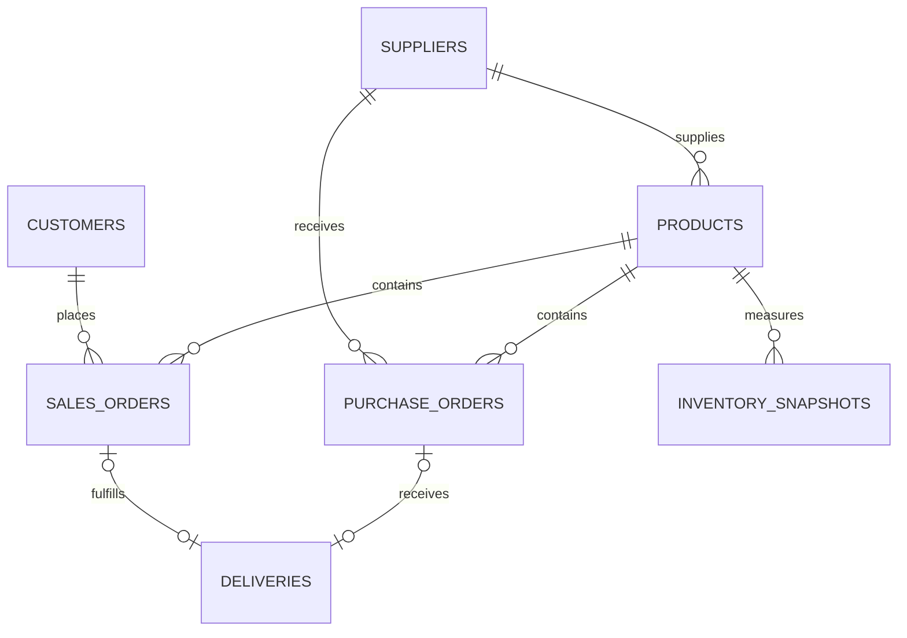

# Veri modeli ve PostgreSQL referansı

**Bu sürüm JSON kullanır.** `backend/schema.sql`, sonraki kalıcı depolama adaptörü için PostgreSQL DDL dosyasıdır; çalışan bir PostgreSQL entegrasyonu olduğu iddia edilmez. Şema bu teslimatta PostgreSQL sunucusunda uygulanmamıştır.

## Temel alanlar

| Varlık         | Anahtar           | Alanlar                                                                                                 |
| -------------- | ----------------- | ------------------------------------------------------------------------------------------------------- |
| Supplier       | `id`              | name, region, leadTime, paymentDays                                                                     |
| Product        | `id`              | name, supplierId, category, unitCost, unitPrice, stock, reserved, dailyDemand, reorderPoint             |
| Customer       | `id`              | name, region                                                                                            |
| Sales order    | `id`              | productId, supplierId, customerId, quantity, unitPrice, date, promisedDate, deliveredAt, status, region |
| Purchase order | `id`              | productId, supplierId, quantity, unitCost, date, promisedDate, deliveredAt, status, region              |
| Delivery       | `id`              | orderId, type, supplierId, productId, carrier, region, dispatchDate, promisedDate, deliveredAt          |
| Local action   | UUID tabanlı `id` | insightId, type, entity, owner, due, notes, status, createdAt                                           |

JSON camelCase alanları referans SQL'de snake_case olur. JSON'daki stok alanları SQL'de `(product_id, as_of)` anahtarlı ayrı `inventory_snapshots` tablosuna taşınır. Delivery'nin `orderId/type` çifti SQL'de iki yabancı anahtar ve XOR kısıtıyla gösterilir; böylece var olmayan sipariş türüne bağlantı kurulamaz.

## Veri bütünlüğü

- Varlıkların kimlikleri tekil, referansları mevcut olmalıdır.
- Miktar pozitif; maliyet, stok, talep ve rezervasyon negatif olamaz.
- Rezerve stok mevcut stoğu aşamaz.
- Teslim edilmiş siparişin gerçek teslim tarihi bulunur; açık siparişin bulunmaz.
- Bir teslimat bağlı siparişin tedarikçi, ürün ve teslim tarihiyle tutarlıdır.
- Anlık tarihten sonraki teslimatlar tamamlanmış olarak yer almaz.
- Para örnek veride tam Euro değeridir; kurumsal sürümde minor-unit integer veya decimal politikası açıkça uygulanmalıdır. Etki tahmininde JS kayan nokta kullanılır; arayüz Euro'ya yuvarlar.

## Sadeleştirmeler

Sipariş tek ürünlüdür; ürünün bir ana tedarikçisi vardır. Şirket bir tenant olarak ele alınır. Gerçek ERP master-data eşlemeleri, satır bazlı sipariş, kısmi sevkiyat, takvim / çalışma günü, çoklu depo, para birimi ve vergi modellemesi yoktur. `days()` takvim günü ve UTC kullanır; hafta sonlarını dışlamaz.

Aksiyonlar SQL modeline dahil edilmedi; mevcut sürüm tarayıcıda saklar. Çok kullanıcılı sürümde kullanıcı, tenant, görev, görev olayları, audit ve optimistik kilitleme alanları eklenmelidir. Aksiyonun “done” olması hiçbir sipariş kaydını değiştirmez.

## İndeks yaklaşımı

Referans DDL'de dönem, müşteri, tedarikçi / dönem ve teslim tarihi indeksleri bulunur. Gerçek sorgu planı ve yük olmadan optimum performans iddiası yoktur. JSON veri kümesini DDL'ye yükleyen çalışır migration / seed adaptörü bu sürümde bulunmaz; dosya açık bir tasarım referansıdır.
